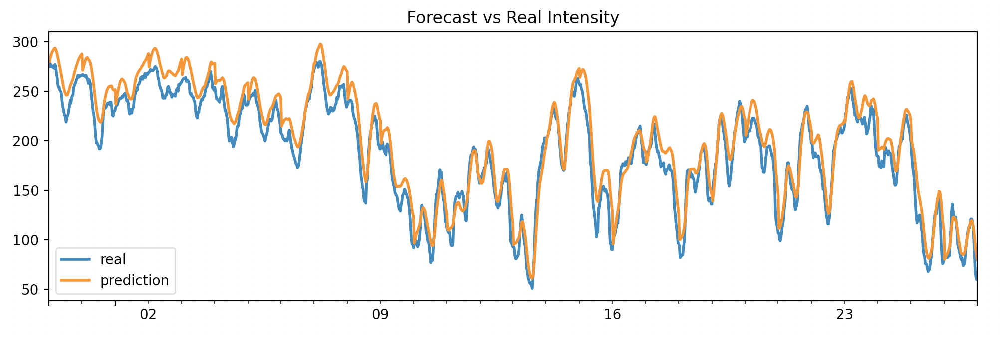

# ForecastIntensity



Install
-------
```
docker pull dpys/forecastintensity:latest
```
or
```
docker build -t forecastintensity .
```

Usage
-----
To begin generating predictions, run the command below, using a local directory of your choice to mount.
```
docker run -it --rm -v {/path/to/a/local/working/directory/to/store/predictions}:/working forecastintensity
```
